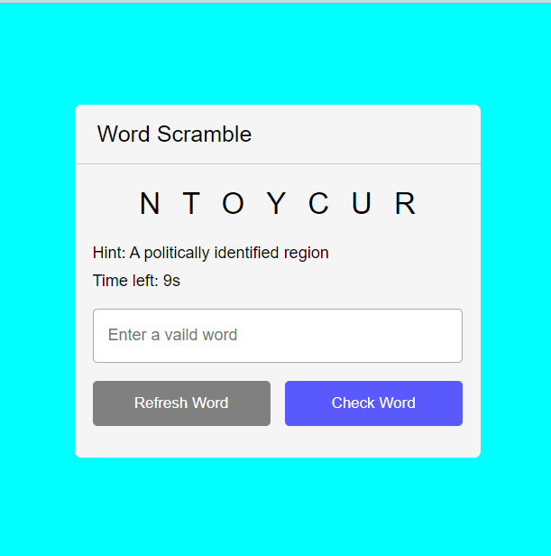

# Simple word-scramble game

## Welcome to scramble game repo 😃

A simple scramble game built with HTML, CSS, JavaScript.

It shows mixed letters of a word and a hint to help the user with time counter.

The user can write the word and check it if it's right or refresh the game to generate a new word.

## Beginner friendly

Feel free to clone the repo and make your own changes to the code.

It's absolutely beginner friendly and I know you can make it much more better. 😁

**Happy Coding** 🤡
